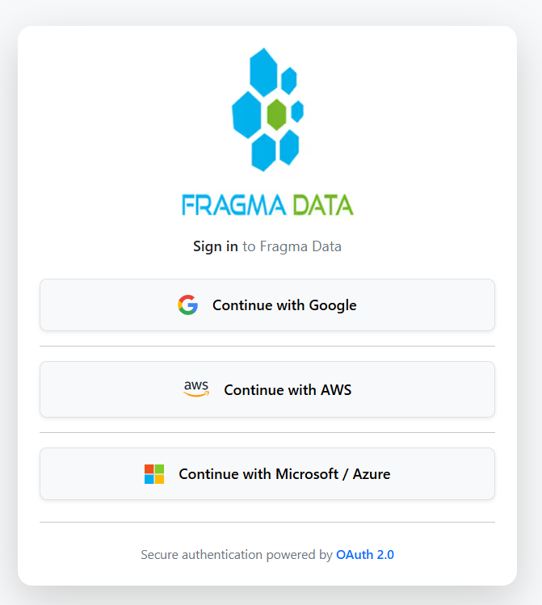

Complete OAuth2LoginFlow 

QUERRY TO INSERT THE PROVIDER DETAILS INTO OUTH_PROVIDERS TABLE

1.GOOGLE

=============
INSERT INTO oauth_provider (
    provider_name,
    display_name,
    is_enabled,
    client_id,
    client_secret,
    authorization_uri,
    token_uri,
    jwk_set_uri,
    scopes,
    redirect_uri
) VALUES (
    'google',
    'Google',
    true,
    'YOUR_GOOGLE_CLIENT_ID',
    'YOUR_GOOGLE_CLIENT_SECRET',
    'https://accounts.google.com/o/oauth2/v2/auth',
    'https://oauth2.googleapis.com/token',
    'https://www.googleapis.com/oauth2/v3/certs',
    'openid,profile,email',
    'http://localhost:8080/login/oauth2/code/google'
);

2.MICROSOFT

===============

INSERT INTO oauth_provider (
    provider_name,
    display_name,
    is_enabled,
    client_id,
    client_secret,
    authorization_uri,
    token_uri,
    jwk_set_uri,
    scopes,
    redirect_uri
) VALUES (
    'microsoft',
    'Microsoft',
    true,
    'YOUR_MICROSOFT_CLIENT_ID',
    'YOUR_MICROSOFT_CLIENT_SECRET',
    'https://login.microsoftonline.com/common/oauth2/v2.0/authorize',
    'https://login.microsoftonline.com/common/oauth2/v2.0/token',
    'https://login.microsoftonline.com/common/discovery/v2.0/keys',
    'openid,profile,email',
    'http://localhost:8080/login/oauth2/code/microsoft'
);

3.AWS

=================
INSERT INTO oauth_provider (
    provider_name,
    display_name,
    is_enabled,
    client_id,
    client_secret,
    authorization_uri,
    token_uri,
    jwk_set_uri,
    scopes,
    redirect_uri
) VALUES (
    'aws',
    'AWS',
    true,
    'YOUR_AWS_COGNITO_CLIENT_ID',
    'YOUR_AWS_COGNITO_CLIENT_SECRET',
    'https://YOUR_COGNITO_DOMAIN.auth.YOUR_REGION.amazoncognito.com/oauth2/authorize',
    'https://YOUR_COGNITO_DOMAIN.auth.YOUR_REGION.amazoncognito.com/oauth2/token',
    'https://cognito-idp.YOUR_REGION.amazonaws.com/YOUR_USER_POOL_ID/.well-known/jwks.json',
    'openid,profile,email',
    'http://localhost:8080/login/oauth2/code/aws'
);
